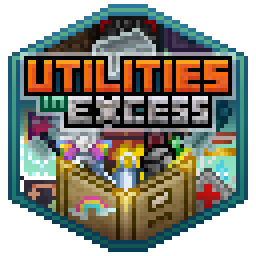

# Utilities In Excess

An open source, cleanroom recreation of [Extra Utilities](https://www.curseforge.com/minecraft/mc-mods/extra-utilities)
for 1.7.10. Written entirely without viewing or reproducing the Extra Utilities source.

## Features

- The entire featureset of Extra Utilities.
- Replacements for integration features like Tinkers Construct parts.
- Better QoL: Empty fluid containers into a fluid trash can from hand! Blocks and items that simply work more smoothly.
- More mod integration: Spikes that work with modded enchantments, gloves that can be worn as a bauble,
[Backhand](https://github.com/GTNewHorizons/Backhand) support for Architect's Wands, and much more!
- New features: UiE contains a small number of new and expanded features, like the Radically Reduced Chest that holds
only a single item and dozens of new cosmetic options for the Heavenly Ring.
- Less bugs (we hope): Extra Utilities was left in a state where many of its features were completely broken. UiE has
aimed specifically to fix these and will receive ongoing support.
- Correct Documentation: Extra Utilities also has many completely wrong info pages that make certain features difficult
to understand. UiE also uses an NEI handler system, but the documentation is actually... not wrong.
- Extreme configurability. UiE is made for the entire 1.7.10 community and we are dedicated to supporting whatever
configurations you prefer or your pack requires.
- **And most importantly, FOSS now and forever!**

## World Conversion

Utilities in Excess features a full suite of [Postea](https://github.com/GTNewHorizons/Postea) transformers for
converting worlds with Extra Utilities blocks and items. These remappings happen seamlessly without any input necessary.

World conversion will happen automatically if Postea is installed, the config **#enableWorldConversion** is enabled
(on by default), and Extra Utilities is *not* installed.

Tinkers Construct conversion works by simply using the same material ids as Extra Utilities. If you want to run UiE and
ExU at the same time, you must change the configs **#bedrockiumTinkersID**, **#invertedTinkersID**,
and **#magicalWoodTinkersID** so that they no longer overlap. Otherwise, the game will crash!

Similarly, dimension remapping works by using the same dimension ids as Extra Utilities. The defaults have been set
to the same as ExU's defaults (-100 and -112). If you are migrating from a world with different ids, change
**#underWorldDimensionId** and **#endOfTimeDimensionId** to match.

## Hard Dependencies
- [GTNHLib](https://github.com/GTNewHorizons/GTNHLib)
- [ModularUI2](https://github.com/GTNewHorizons/ModularUI2)
- [UniMixins](https://github.com/LegacyModdingMC/UniMixins)
- [CoFH Lib](https://www.curseforge.com/minecraft/mc-mods/cofh-lib)

## Optional Dependencies

- [Angelica](https://github.com/GTNewHorizons/Angelica) (Connected Textures)
- [Postea](https://github.com/GTNewHorizons/Postea) (World conversion system)
- [Tinkers Construct](https://github.com/GTNewHorizons/TinkersConstruct) (New materials)
- [Forge Multipart](https://github.com/GTNewHorizons/ForgeMultipart) (New microblock shapes)
- [Backhand](https://github.com/GTNewHorizons/Backhand) (Architect's Wand integration)
- [FindIt](https://github.com/GTNewHorizons/FindIt) (Trading Post integration)
- [Baubles](https://www.curseforge.com/minecraft/mc-mods/baubles) (Heavenly Ring and Glove integration)
- [EndlessIDs](https://www.curseforge.com/minecraft/mc-mods/endlessids) (Dyeable colored blocks)

## Credits
A special thanks to the 1.0 contributors, without which this project could have never gotten off the ground:

### Project Lead
- FourIsTheNumber

### Artists
 &nbsp; &nbsp;   &nbsp; &nbsp;&nbsp;Embri  
 &nbsp; &nbsp;   &nbsp; &nbsp;&nbsp;seventh-june  
 &nbsp; &nbsp; &nbsp;  &nbsp;&nbsp; &nbsp;&nbsp;Freya  
 &nbsp;  &nbsp; EmeraldsEmerald  

### Programmers
- jurrejelle (Redstone Clock, Drums, Cursed Earth, Trash Cans, Architect's Wand)
- Caedis (Heavenly Ring, Ethereal Glass, Chandelier)
- KydZombie (Magic Wood, Inverted Tools)
- 0hwx (Watering Can, Filing Cabinet)
- dibbydoba (Pure Love, Special Chests, Sound/Rain Muffler)
- rspforhp (Inverted Tools)
- lynxx131 (Golden Bag of Holding, Block Update Detector)
- DeathFuel (Blackout Curtains)
- RecursivePineapple (Conveyors, The Underworld)
- serenibyss (Ender Locus)
- koolkrafter5 (End of Time)
- SuperSoupr (Glove, Blessed Earth, Colored Blocks, Trading Post, World Converter, Chunchunmaru)
- loenaaaa (Generators, Decorative Blocks, Pseudo-Inversion Ritual)
- sisyphussy (Underworld Portal Renderer)
- Ranzuu (Localization Work)
- Cardinalstars (Forge Microblocks, Transfer Nodes)
- tomasz-brak (Architects Wand Backhand/GT5U Integration)
- Spicierspace153 (Collector)
- MalTeeez (Void Quarry)
- Spaghetti-OberNub (Bugfixes and Polish)
- Nikolay-Sitnikov (Code Review)
